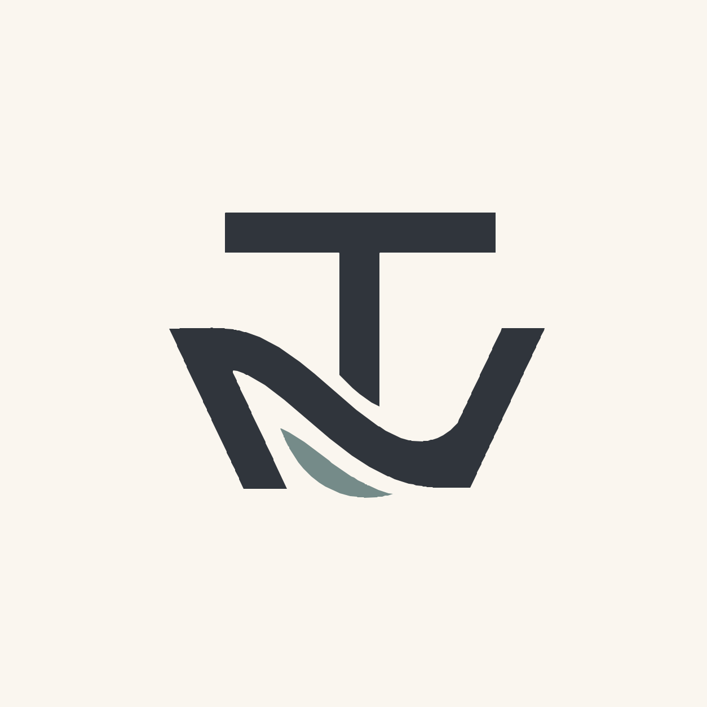

<p align="center">
  
</p>
<h1 align="center">WaveLab</h1>
<p align="center">Small experiments. Real code. A few deliberately bad decisions.</p>
<p align="center"><a href="#start-here">Run a demo</a> · <a href="demos/autonomy-mastra">Explore the code</a> · <a href="https://tomerwave.com">TomerWave</a></p>

---

This is where I keep examples from my talks and experiments. Each one starts with a concrete problem, makes the behavior visible, and gives you something small enough to change yourself.

The first experiment: an AI assistant that can ask for a refund. The interesting part is what the tool lets it do.

## Start here

You'll need Node.js 22.13 or later. The stage demos need no API key.

```sh
npm ci
npm run demo -- workflow
npm run demo -- investigate
npm run demo -- unsafe
npm run demo -- guarded
npm run demo -- retry
```

## In the lab

| Experiment | Question | Stack |
| --- | --- | --- |
| [Autonomy, under supervision](demos/autonomy-mastra) | What should the model decide, and what must the tool enforce? | TypeScript, Node.js, Mastra |

### One request. Two very different outcomes.

Dana sees two charges and asks for a refund. We start with a known workflow, investigate a less obvious case, then compare a permissive function with a guarded tool.

| Command | What you'll see |
| --- | --- |
| `workflow` | A real Mastra workflow handles a verified duplicate |
| `investigate` | A scripted replay calls real Mastra tools and hits an access boundary |
| `unsafe` | The intentionally broken function refunds a charge in another account |
| `guarded` | The same request is blocked by server-side authorization |
| `retry` | Repeated requests return one simulated refund receipt |

All billing data is fictional. `investigate` is a replay, not a live model choosing tools. The optional `live` mode uses a real Mastra Agent and needs provider credentials. See the [demo guide](demos/autonomy-mastra/README.md) for setup and limitations.

## Find your way around

| Path | What's inside |
| --- | --- |
| `demos/autonomy-mastra/src/agent.ts` | The agent's instructions and protected tools |
| `demos/autonomy-mastra/src/workflow.ts` | The route we choose in advance |
| `demos/autonomy-mastra/src/tools.ts` | Mastra tool definitions and input schemas |
| `demos/autonomy-mastra/src/billing.ts` | Authorization, refund policy and repeat handling |
| `demos/autonomy-mastra/examples/` | Recorded outputs for comparison |
| `assets/` | TomerWave branding |

## Check your changes

```sh
npm run check
```

This runs Godharness validation, Godlint policy checks, type checking, seven behavior tests and the build. The tests exercise real Mastra tools and workflows. They do not evaluate a live model's decisions.

## Engineering guardrails

[Godharness](https://github.com/tomerwave/godharness) supplies the project context before an agent changes code. [Godlint](https://github.com/tomerwave/godlint) checks the code afterwards. Both are pinned development dependencies installed by `npm ci`.

```sh
npm run harness:check
npm run lint
npm run lint:json
```

Codex and Claude Code hooks use the repository's installed Godharness. Start your coding agent from the repository root after installing dependencies. The [WaveLab standard](docs/godharness/wavelab.md) explains the demo boundaries. CI reports Godlint findings as GitHub annotations and JSON logs; errors and warnings fail the gate.

## Add an experiment

Put it under `demos/<name>/` with a unique npm workspace name, a README and runnable examples. Add `test`, `typecheck` and `build` scripts where they apply. Run it with:

```sh
npm run demo --workspace=@tomerwave/<name> -- <mode>
```

Keep dependencies local to the demo and commit the root lockfile. Share code when two examples actually need it.

Found a surprising edge case? Open an issue with the command, input and output. That's useful material for the next talk.

## Take it into your own project

Try changing one rule, run the demo again, and see what breaks. If you find an interesting case, [open an issue](https://github.com/tomerwave/wave-lab/issues/new) with the input and what you expected.

Working through similar decisions in your team? I help teams design and build systems like these, and teach the reasoning behind them. [Let’s talk](https://tomerwave.com/meet).

Built by [Tomer Gal](https://tomerwave.com).

## License

Code and documentation are available under [MIT](LICENSE). The TomerWave name and icon identify the project; the code license does not grant trademark rights.
